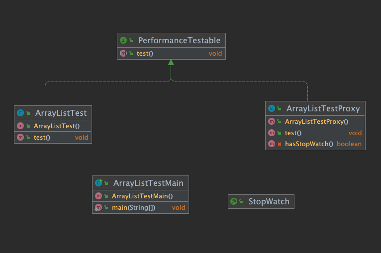
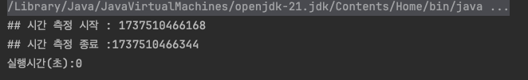

# Java 어노테이션(Annotation)과 JavaDoc 정리

## JavaDoc
JavaDoc은 Java 소스코드와 문서를 하나의 파일로 관리하기 위한 문서화 도구입니다. `/** */` 형태의 주석을 사용하여 작성합니다.

### 주요 JavaDoc 태그
- **@author**: 클래스/인터페이스 제작자
- **@version**: 버전 정보
- **@param**: 매개변수 설명
- **@return**: 반환값 설명 (void가 아닌 경우 필수)
- **@see**: 참조 링크 제공
- **@throws/@exception**: 예외 설명
- **@deprecated**: 더 이상 사용하지 않는 메서드 표시
- **@since**: 도입된 버전 명시

## JAVA Doc 생성 (IntelliJ)
- Shift + Shift 두번 누르면 생성 가능

## VsCode JAVA Doc 
- Extension : Javadoc-Generator
- https://marketplace.visualstudio.com/items?itemName=KeeganBruer.javadoc-generator
- Mac : command + Shift + P

## 어노테이션(Annotation)이란?
어노테이션은 Java 5부터 도입된 기능으로, 프로그램에 대한 메타데이터를 제공합니다. 직접적인 코드는 아니지만 프로그램 작성에 도움을 주는 정보를 제공합니다.

### 어노테이션의 주요 용도
1. 컴파일러에게 코드 문법 에러 체크 정보 제공
2. 빌드나 배포 시 코드 자동 생성 정보 제공 (예: Lombok)
3. 런타임에 특정 기능 실행을 위한 정보 제공
4. AOP(관점 지향 프로그래밍) 구현

### 주요 내장 어노테이션
1. **@Override**: 메서드 재정의 표시
2. **@SuppressWarnings**: 컴파일 경고 무시
3. **@SafeVarargs**: 제네릭 가변인자 관련 경고 억제
4. **@FunctionalInterface**: 함수형 인터페이스 명시
5. **@Native**: 네이티브 메서드 참조 상수 표시

### 메타 어노테이션
메타 어노테이션은 어노테이션을 정의할 때 사용하는 어노테이션입니다.

1. **@Target**: 어노테이션 적용 가능 위치 지정
- PACKAGE, TYPE, METHOD, FIELD 등

2. **@Retention**: 어노테이션 유지 범위 지정
- RUNTIME: JVM 실행 시까지 유지
- CLASS: 컴파일 시까지 유지
- SOURCE: 컴파일 전까지만 유지

3. **@Inherited**: 자식 클래스로의 어노테이션 상속 허용

4. **@Deprecated**: 더 이상 사용하지 않음을 표시

5. **@Repeatable**: 어노테이션 반복 사용 허용

6. **@Documented**: JavaDoc 문서에 어노테이션 정보 포함

---
# Annotation을 이용한 StopWatch 만들기
- ArrayList의 1 to 100000000 까지 add 하는 예제입니다.
- Collection Framework List 편에서 LinkedList, ArrayList의 성능 이슈에 대한 시간(초) 측정 테스트를 Annotation을 이용해서 구현하는 간단한 예제 입니다.

## Proxy 패턴을 이용한 단순한 구조 


### StopWatch.java
```java
package com.nhnacademy.day3.stopwatch;


import java.lang.annotation.ElementType;
import java.lang.annotation.Retention;
import java.lang.annotation.RetentionPolicy;
import java.lang.annotation.Target;

@Target(value =  {ElementType.METHOD})
@Retention(RetentionPolicy.RUNTIME)

public @interface StopWatch {

}
```

### PerformanceTestable.java
```java
package com.nhnacademy.day3.stopwatch;

public interface PerformanceTestable {
    void test();
}
```

### ArrayListTest.java
```java
package com.nhnacademy.day3.stopwatch;

import java.util.ArrayList;
import java.util.List;

public class ArrayListTest implements  PerformanceTestable{

    @StopWatch
    @Override
    public void test() {
        List<Integer> integerList = new ArrayList<>();
        for (int i = 0; i < 10000000; i++) {
            integerList.add(i);
        }
    }
}
```

### ArrayListTestMain.java
```java
package com.nhnacademy.day3.stopwatch;

public class ArrayListTestMain {
    public static void main(String[] args) {
        ArrayListTest arrayListTest = new ArrayListTest();
        arrayListTest.test();
    }
}
```
- main 만들어서 실행하기
- 동작은 하지만 실행시간에 대한 측정은 일어나지 않음
- 여기까지는 일반적인 객체 생성 후 method 실행하는 과정

### ArrayListTestProxy.java
```java
package com.nhnacademy.day3.stopwatch;

import java.lang.reflect.Method;
import java.util.Objects;

public class ArrayListTestProxy implements PerformanceTestable {

    // 다른 테스트 가능한 객체를 감싸서 실행시간을 측정해주는 래퍼(포장) 클래스
    private final PerformanceTestable performanceTestable; // 실제 테스트할 객체

    public ArrayListTestProxy(PerformanceTestable performanceTestable){
        this.performanceTestable = performanceTestable;
    }


    @Override
    public void test() {
        if(hasStopWatch()){ // StopWatch 어노테이션이 있는지 확인
            long start = System.currentTimeMillis();
            System.out.println("## 시간 측정 시작 : "+start);
            performanceTestable.test();
            long end = System.currentTimeMillis();
            System.out.println("## 시간 측정 종료 :" + end);

            long result = (end-start)/1000;
            System.out.println("실행시간(초):"+result);

        }
    }

    private boolean hasStopWatch() {
        // 클래스의 모든 메서드를 검사해서
        for(Method method:performanceTestable.getClass().getDeclaredMethods()){
            // @StopWatch 어노테이션이 있는지 확인
            StopWatch stopWatch = method.getAnnotation(StopWatch.class);
            if(Objects.nonNull(stopWatch)){ // 어노테이션이 있으면 true 반환
                return true;
            }
        }

        return false;
    }
}
```
- @StopWatch 어노테이션이 붙은 메서드의 실행 시간을 측정


```java
package com.nhnacademy.day3.stopwatch;

public class ArrayListTestMain {
    public static void main(String[] args) {
        ArrayListTest arrayListTest = new ArrayListTest();

        ArrayListTestProxy arrayListTestProxy = new ArrayListTestProxy(arrayListTest);
        arrayListTestProxy.test();
    }
}
```




---
## 연습문제
LinkedListTest.java를 만들어서 ArrayListTest와 실행시간(초) 비교할 수 있도록 구현해 주세요.

### LinkedListTest.java
```java
package com.nhnacademy.day3.stopwatch;

import java.util.LinkedList;
import java.util.List;

public class LinkedListTest implements  PerformanceTestable{

    @StopWatch
    @Override
    public void test() {
        List<Integer> integerList = new LinkedList<>();
        for (int i = 0; i < 10000000; i++) {
            integerList.add(i);
        }

    }
}
```

```java
package com.nhnacademy.day3.stopwatch;

public class ArrayListTestMain {
    public static void main(String[] args) {

        System.out.println("===ArrayList 테스트===");
        ArrayListTest arrayListTest = new ArrayListTest();
        ArrayListTestProxy arrayListTestProxy = new ArrayListTestProxy(arrayListTest);
        arrayListTestProxy.test();

        System.out.println("===LinkedList 테스트===");
        LinkedListTest linkedListTest = new LinkedListTest();
        ArrayListTestProxy linkedListProxy = new ArrayListTestProxy(linkedListTest);
        linkedListProxy.test();
    }
}
```

> 즉 @StopWatch는 "이 메서드의 실행 시간을 측정해주세요"라는 표시
실제로 성능을 테스트하고 싶은 메서드에만 붙이고
프록시 클래스(ArrayListTestProxy)는 시간을 측정하는 도구이므로 여기에는 붙이지 않음

