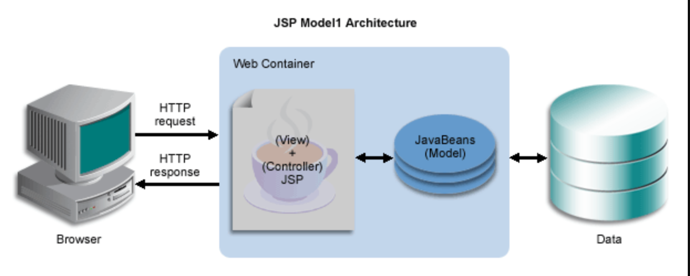
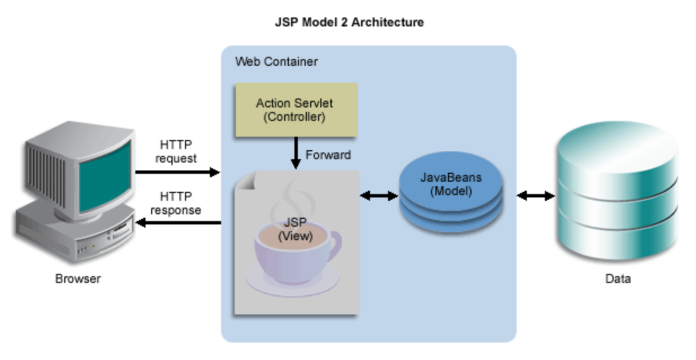
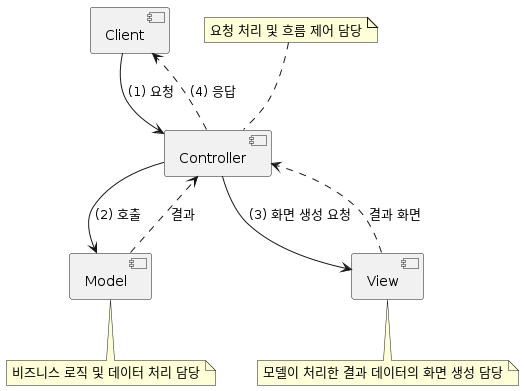
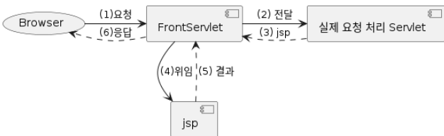
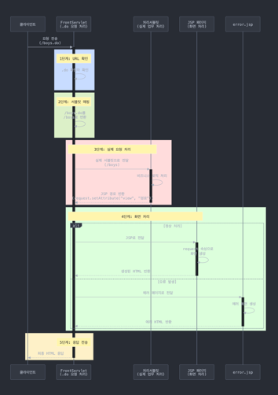

# MVC Pattern

## Model1

- JSP 페이지가 모든 로직과 출력을 담당
- 비즈니스 로직과 화면 출력 코드가 하나의 JSP에 혼재
- 코드 가독성 저하 , 유지보수 어려움

## Model2

- 서블릿이 모든 요청을 받아 처리하고 JSP로 포워딩
- 클라이언트 요청을 서블릿에서 구분해서 처리
- MVC 패턴의 기초가 됨


## Model2 방식 == MVC Pattern


- Model : 비즈니스 로직과 데이터 처리 담당
- View : 처리된 결과를 화면에 표시
- Controller : 요청 처리 후 전체 흐름 제어

### 이렇게 하면?
- 유연하고 확장이 용이하며
- 팀단위 협업이 수월해지고
- 유지보수가 쉬워짐

그렇지만 Servlet을 학습하다보면 중복 코드가 많이 보이게 된다

**예시코드**
```
resp.setContentType("text/html");
resp.setCharacterEncoding("UTF-8");

// ...

try {
    RequestDispatcher rd = req.getRequestDispatcher("...");
    rd.forward(req, resp);
    // resp.sendRedirect("...");
} catch (ServletException | IOException ex) {
    log.error("", ex);
}
```

## 공통 처리 부분과 그렇지 않은 부분을 분리해보자

### 공통 처리 부분

**FrontServlet**


1. 모든 요청을 Servlet이 다 받는데, 실제 요청이랑은 어떻게 구분하나?
   - FrontServlet이 받을 요청은 .do 확장자를 사용
   - 실제 요청은 .do 확장자가 없음
   - Ex)
     - /boys.do : FrontServlet이 처리
     - /boys : 실제 요청은 Servlet이 처리
2. URL에 따라 적절한 Servlet으로 요청 전달
3. 실제 요청을 처리한 Servlet은 처리 결과를 어떤 jsp에 view를 할건지 반환
4. 실제 요청을 처리한 Servlet이 전달해 준 jsp로 view 처리를 위임
   - 에러 발생시 error page로 지정된 jsp에 view 처리 위임
5. JSP는 실제 요청을 처리한 Servlet에서 ServletRequest에서 설정한 속성을 이용해 View처리 수행
6. FrontServlet이 클라이언트에게 결과 응답

## 클라이언트의 요청부터 응답까지의 흐름

### 1단계: URL 확인 (파란 영역)
* 클라이언트가 보낸 요청의 URL이 .do로 끝나는지 확인
* FrontServlet이 처리할 요청인지 판단

### 2단계: 서블릿 매핑 (연두 영역)
* .do로 끝나는 URL을 실제 처리할 서블릿 경로로 변환
* 예시: /boys.do → /boys

### 3단계: 실제 요청 처리 (빨간 영역)
* 변환된 경로의 실제 서블릿으로 요청 전달
* 해당 서블릿에서 비즈니스 로직 처리
* 처리 결과와 보여줄 JSP 페이지 경로를 지정

### 4단계: 화면 처리 (초록 영역)

**정상 처리된 경우**
* 지정된 JSP로 요청 전달
* JSP에서 전달받은 데이터로 화면 생성

**오류 발생한 경우**
* error.jsp로 전달
* 에러 화면 생성

### 5단계: 응답 전송 (주황 영역)
* 생성된 최종 HTML을 클라이언트에게 전송
* 모든 처리 완료

---

### FrontServlet
위에서 기술한대로 실제 요청은 .do 확장자를 기준으로 처리하는데 사용 방법은 어노테이션 파라미터에 추가하는 방식이다
```java
@Slf4j
@WebServlet(name = "frontServlet", urlPatterns = "*.do")
public class FrontServlet extends HttpServlet {
    private static final String REDIRECT_PREFIX = "redirect:";

    @Override
    protected void service(HttpServletRequest req, HttpServletResponse resp)
        throws ServletException, IOException {
        // 공통 처리 - 응답 content-type, character encoding 지정.
        resp.setContentType("text/html");
        resp.setCharacterEncoding("UTF-8");

        try {
            // 실제 요청 처리할 Servlet 결정.
            String processingServletPath = resolveServlet(req.getServletPath());

            // 실제 요청을 처리할 Servlet으로 요청을 전달하여 처리 결과를 include시킴.
            RequestDispatcher rd = req.getRequestDispatcher(processingServletPath);
            rd.include(req, resp);

            // 실제 요청을 처리한 Servlet이 `view`라는 request 속성 값으로 view를 전달해 줌.
            String view = (String) req.getAttribute("view");
            if (view.startsWith(REDIRECT_PREFIX)) {
                // `redirect:`로 시작하면 redirect 처리.
                resp.sendRedirect(view.substring(REDIRECT_PREFIX.length()));
            } else {
                // redirect 아니면 JSP에게 view 처리를 위임하여 그 결과를 include시킴.
                rd = req.getRequestDispatcher(view);
                rd.include(req, resp);
            }
        } catch (Exception ex) {
            // 에러가 발생한 경우는 error page로 지정된 `/error.jsp`에게 view 처리를 위임.
            log.error("", ex);
            req.setAttribute("exception", ex);
            RequestDispatcher rd = req.getRequestDispatcher("/error.jsp");
            rd.forward(req, resp);
        }
    }

    // 요청 URL에 따라 실제 요청을 처리할 Servlet 결정.
    private String resolveServlet(String servletPath) {
        String processingServletPath = null;

        if ("/cart.do".equals(servletPath)) {
            processingServletPath = "/cart";
        } else if ("/foods.do".equals(servletPath)) {
            processingServletPath = "/foods";
        } else if ("/login.do".equals(servletPath)) {
            processingServletPath = "/login";
        } else if ("/logout.do".equals(servletPath)) {
            processingServletPath = "/logout";
        } else if ("/change-lang.do".equals(servletPath)) {
            processingServletPath = "/change-lang";
        }

        return processingServletPath;
    }
}
```

**예시**
장바구니 페이지를 보여주는 과정을 생각해보자
```
고객 -> 장바구니 버튼 클릭 (/cart.do) -> 서버
```

FrontServlet의 역할은 안내데스크와 비슷하다

1. 요청 받기
```java
// 고객이 /cart.do로 요청을 보내면
String processingServletPath = resolveServlet(req.getServletPath());
// "/cart.do" -> "/cart"로 변환
```
2. 실제 담당자에게 전달
```java
// 변환된 /cart 경로의 실제 서블릿으로 요청 전달
RequestDispatcher rd = req.getRequestDispatcher(processingServletPath);
rd.include(req, resp);
```
- 실제 처리과정은
    - 고객(클라이언트)이 안내데스크(FrontServlet)에 장바구니 보기를 요청 (/cart.do)   
    - 안내데스크는 장바구니 담당자(/cart 서블릿)에게 요청을 전달 
    - 담당자가 장바구니 정보를 조회하고 결과를 준비 
    - 결과를 보여줄 화면(JSP)을 지정

> 📚📚실제 시나리오
고객이 장바구니 버튼 클릭 (/cart.do)
FrontServlet이 요청을 받음
/cart.do를 /cart로 변환
/cart 서블릿이 장바구니 정보 조회
결과를 cart.jsp에 전달
화면에 장바구니 표시

- 어렵게 생각할 필요 없이 백화점 안내도와 같다
고객이 보는 위치    ->    실제 내부 위치
"1층 안내데스크"    ->    "A-101구역"
"식품매장"         ->    "B-201구역"
"고객센터"         ->    "C-301구역"

---
# FrontServlet 적용 후 변화 

### 서블릿 간소화 

```java
// 기존 서블릿
public class SomeServlet extends HttpServlet {
    protected void doGet(HttpServletRequest req, HttpServletResponse resp) {
        // 1. 인코딩 설정
        // 2. 비즈니스 로직
        // 3. JSP 포워딩
        // 4. 에러 처리
    }
}

// FrontServlet 적용 후
public class SomeServlet extends HttpServlet {
    protected void doGet(HttpServletRequest req, HttpServletResponse resp) {
        // 비즈니스 로직만 처리
        req.setAttribute("view", "/WEB-INF/views/some.jsp");
    }
}
```
- 공통 로직 제거 - FrontServlet 해주니까
- view 처리 - request.setAttribute("view", "{JSP 경로}") 만 해주면 됨

### Servlet과 JSP 에서 외부 접근 URL은 모두 /???.do로 변경
- 사용자에게 노출되는 URL은 .do 확장자를 가짐
- 실제 요청 처리 URL은 .do 확장자가 없음
```
예시:
고객이 보는 주소: /cart.do  →  실제 처리 주소: /cart
고객이 보는 주소: /login.do →  실제 처리 주소: /login
```
### Filter 적용 URL도 모두 *.do로 변경
- RequestDispatcher 에 의한 include/forward 시 request 공유되기 때문에 Filter 처리도 .do URL만 하면 됨

### 이렇게 한다면 ...
서블릿들이 하는 일이 매우 단순해짐
```java
// 서블릿이 하는 일이 이것뿐!
request.setAttribute("view", "보여줄페이지.jsp");
```

### doGet, doPost 각각을 나눠서 별도의 클래스로 분리하면
- 각각의 클래스들은 
  - FrontServlet과는 RequestDispatcher 에 의해 request 공유되며,
  - view JSP 경로 제공만 해주면 FrontServlet에서 response에 대한 공통 처리가 이루어지므로 굳이 하나의 Servlet일 필요도 없음

**기존 서블릿 방식**
```java
public class CartServlet extends HttpServlet {
    // GET 요청 처리
    protected void doGet(...) {
        // 장바구니 조회 로직
    }
    
    // POST 요청 처리
    protected void doPost(...) {
        // 장바구니 추가 로직
    }
}
```

**Command 패턴으로 변경**
```java
// 1. 공통 인터페이스 정의
interface Command {
    String execute(HttpServletRequest request, HttpServletResponse response);
}

// 2. GET 요청을 처리하는 클래스
class ViewCartCommand implements Command {
    public String execute(HttpRequest request, HttpResponse response) {
        // 장바구니 조회 로직
        return "cart/view.jsp";  // 보여줄 JSP 경로 반환
    }
}

// 3. POST 요청을 처리하는 클래스
class AddCartCommand implements Command {
    public String execute(HttpRequest request, HttpResponse response) {
        // 장바구니 추가 로직
        return "cart/add.jsp";   // 보여줄 JSP 경로 반환
    }
}
```

- 더 이상 서블릿을 상속할 필요가 없음
기존: extends HttpServlet 필요
변경: implements Command로 충분

- 요청/응답 공유
FrontServlet이 받은 request, response를 Command 클래스가 그대로 사용
별도 데이터 전달 과정 불필요

## FrontServlet vs Servlet
| 구분 | FrontServlet | 일반 Servlet |
|------|--------------|--------------|
| **역할** | 안내 데스크 | 실무 담당자 |
| **URL 매핑** | `*.do` (모든 .do 요청) | `/cart`, `/login` 등 (특정 기능) |
| **처리 범위** | 모든 요청의 공통 처리 | 특정 업무 로직만 처리 |
| **주요 기능** | - 요청 최초 접수<br>- 담당 Servlet 분배<br>- 공통 처리(인코딩)<br>- JSP 연결 | - 비즈니스 로직 처리<br>- DB 작업<br>- 결과 데이터 준비<br>- 뷰 페이지 선택 |
| **코드 예시** | ```@WebServlet("*.do")``` | ```@WebServlet("/cart")``` |
| **처리 순서** | 1번째 (요청 접수) | 2번째 (실제 처리) |
| **비유** | 회사 1층 안내 데스크 | 각 층의 업무 담당자 |


