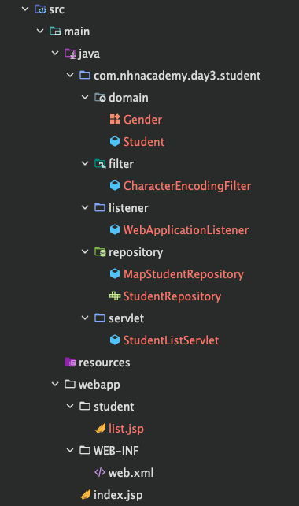

# 디렉토리 구조


**Student.java**

```java

public class Student implements Serializable {

    /*
    Web-App을 war로 만들어 서버 업로드 후 사용하는 과정에서 직렬화가 안되어있는 클래스는 war파일 압축 불가
    서버 배포하는 프로그램은 반드시 Serializable를 구현해야함

    디폴트 생성자
    모든 필드 변수에 대해 Getter, Setter 필요

     */
    private static final long serialVersionUID = 1L;

    private String id;

    private String name;

    private Gender gender;

    private int age;

    private LocalDateTime createdAt;


    public Student() {

    }
    // 생성자, Getter, Setter ...
}
```

## 학생 - 리스트

**WebApplicationListener**
```java
package com.nhnacademy.day3.student.listener;

import com.nhnacademy.day3.student.domain.Gender;
import com.nhnacademy.day3.student.repository.MapStudentRepository;
import com.nhnacademy.day3.student.domain.Student;
import com.nhnacademy.day3.student.repository.StudentRepository;
import jakarta.servlet.ServletContext;
import jakarta.servlet.ServletContextEvent;
import jakarta.servlet.ServletContextListener;
import jakarta.servlet.annotation.WebListener;

import java.util.Random;

//application 구동시 student1~student10 학생 등록하기
@WebListener
public class WebApplicationListener implements ServletContextListener {

    @Override
    public void contextInitialized(ServletContextEvent sce) {
        ServletContext context = sce.getServletContext();
        StudentRepository studentRepository = new MapStudentRepository();

        Random random = new Random();

        for(int i = 1; i<=10; i++){
            // ... student 1 ~ 10 생성하기
            String id = "student"+1;
            String name = "학생" + i;
            Gender gender = (i%2==0) ? Gender.M:Gender.F;
            // 나이는 20~30 사이 랜덤
            int age = random.nextInt(20, 31);

            Student student = new Student(id, name, gender, age);
            studentRepository.save(student);


        }

        // application scope에 studentRepository 저장
        context.setAttribute("studentRepository", studentRepository);
    }
}
```

**list.jsp**
```
<%@ page contentType="text/html;charset=UTF-8" language="java" trimDirectiveWhitespaces="true" %>
<%@ taglib prefix="c" uri="jakarta.tags.core" %>

<html>
<head>
  <title>student - list</title>
  <link rel="stylesheet" href="/style.css" />
</head>

<body>
<h1>학생 리스트</h1>
<p><a href="/student/register" >학생(등록)</a></p>
<table>
  <thead>
  <tr>
    <th>아이디</th>
    <th>이름</th>
    <th>성별</th>
    <th>나이</th>
    <th>cmd</th>
  </tr>
  </thead>
  <tbody>
  <c:forEach var = "student" items="${studentList}">
    <tr>
      <td>${student.id}</td>
      <td>${student.name}</td>
      <td>${student.gender}</td>
      <td>${student.age}</td>
      <td>
        <a href="/student/view?id=${student.id}">조회</a>
        <a href="/student/update?id=${student.id}">수정</a>
        <a href="/student/delete?id=${student.id}">삭제</a>
      </td>
    </tr>
  </c:forEach>
  </tbody>
</table>
</body>
</html>
```

**StudentListServlet**
```java
package com.nhnacademy.day3.student.servlet;

import com.nhnacademy.day3.student.domain.Student;
import com.nhnacademy.day3.student.repository.StudentRepository;
import jakarta.servlet.ServletConfig;
import jakarta.servlet.ServletException;
import jakarta.servlet.annotation.WebServlet;
import jakarta.servlet.http.HttpServlet;
import jakarta.servlet.http.HttpServletRequest;
import jakarta.servlet.http.HttpServletResponse;
import lombok.extern.slf4j.Slf4j;

import java.io.IOException;
import java.util.List;

@Slf4j
@WebServlet(name = "studentListServlet", urlPatterns = "/student/list")
public class StudentListServlet extends HttpServlet {

    private StudentRepository studentRepository;

    @Override
    public void init(ServletConfig config) throws ServletException {
        studentRepository = (StudentRepository) config.getServletContext().getAttribute("studentRepository");
    }

    @Override
    protected void doGet(HttpServletRequest req, HttpServletResponse resp) throws ServletException, IOException {
        //student list 구하기
        List<Student> studentList = studentRepository.getStudents();

        req.setAttribute("studentList",studentList);

        /*
        /student/list.jsp <- forward 하기
        다른 리소스(JSP, 서블릿 등)로 요청을 전달할 수 있는 RequestDispatcher 객체를 생성
        매개변수로 전달할 리소스의 경로를 지정
        webapp 폴더가 root 경로("/")가 됨
        현재 요청(request)과 응답(response)을 다른 리소스로 전달
        제어권을 완전히 이동시킴 (URL 변경 없음)
         */

        req.getRequestDispatcher("/student/list.jsp").forward(req,resp);
    }

}
```

## StudentList 처리 흐름
1. WebApplicationListener 실행 (서버 시작 시)

```java
@WebListener
public class WebApplicationListener implements ServletContextListener {
    public void contextInitialized(ServletContextEvent sce) {
        // 1. StudentRepository 생성
        // 2. 10명의 학생 데이터 생성 및 저장
        // 3. application scope에 studentRepository 저장
    }
}
```

2. 클라이언트 요청
```
브라우저에서 /student/list 요청
```

3. CharacterEncodingFilter 동작
```java
@WebFilter("/*")
public class CharacterEncodingFilter implements Filter {
    // UTF-8 인코딩 설정
}
```

4. StudentListServlet 처리
```java
@WebServlet("/student/list")
public class StudentListServlet extends HttpServlet {
    // 1. studentRepository 가져오기 (init)
    // 2. 학생 목록 조회
    // 3. request에 studentList 저장
    // 4. list.jsp로 forward
}
```

5. list.jsp 실행
```
// 1. studentList를 받아서
// 2. forEach로 반복하면서
// 3. 테이블 형태로 출력
```

전체 흐름도
>[서버 시작]
↓
WebApplicationListener (학생 데이터 초기화)
↓
[클라이언트 /student/list 요청]
↓
CharacterEncodingFilter (UTF-8 설정)
↓
StudentListServlet (학생 목록 조회)
↓
list.jsp (화면 출력)
↓
[클라이언트에게 응답]

---

## 학생 - 등록 
